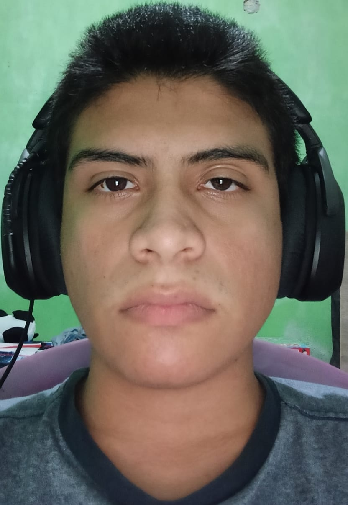

# Reflexión personal sobre el diseño de videojuegos

## Mis intereses y experiencias previas

Mi interés actual en los videojuegos se centra en la posibilidad de **crear experiencias que puedan enseñar algo a alguien**, ya sea a través de emociones, decisiones o situaciones que inviten a la reflexión. No me atrae únicamente el aspecto visual o técnico del videojuego, sino el impacto que puede generar en el jugador.

En cuanto a los géneros que más me llaman la atención, actualmente me gustan mucho los **Hero Shooters**, ya que suelen ofrecer partidas relativamente rápidas, dinámicas y frenéticas, lo que mantiene al jugador constantemente activo y concentrado. Considero que este tipo de juegos logra un buen equilibrio entre entretenimiento y diseño estratégico, algo que me resulta muy interesante como futuro desarrollador.

Aunque aún me encuentro en proceso de aprendizaje dentro del desarrollo de videojuegos, he comenzado a familiarizarme con herramientas como motores gráficos y software de modelado, lo que ha reforzado mi interés por comprender no solo cómo se juega un videojuego, sino cómo se construye desde sus bases.

---

## ¿Qué significa para mí diseñar un videojuego?

Para mí, **diseñar un videojuego no es simplemente crear un programa para que el jugador pase horas frente a una pantalla**. Considero que el diseño de videojuegos implica construir una historia, un trasfondo y una profundidad que puedan marcar al jugador de alguna manera.

Un videojuego, desde mi perspectiva, debe ser una **experiencia significativa**, capaz de transmitir ideas, emociones o aprendizajes, y no limitarse únicamente al entretenimiento superficial. Sin embargo, esto no significa que la diversión deba quedar de lado; al contrario, el entretenimiento es una parte fundamental del videojuego, ya que fue creado precisamente para ser disfrutado. El verdadero reto está en **combinar diversión con mensaje y experiencia**.

---

## Mi rol como diseñador durante el curso

Durante este curso, me imagino desempeñando un rol activo como diseñador, con una actitud abierta al aprendizaje y a la experimentación. Mi objetivo es **comprender el proceso completo del diseño de un videojuego**, desde la idea inicial hasta la experiencia final del jugador.

Espero poder aportar creatividad, análisis y reflexión en cada etapa del desarrollo, así como aprender a justificar mis decisiones de diseño con base en la experiencia del usuario. También considero importante equivocarme y mejorar, ya que el diseño de videojuegos es un proceso iterativo que se fortalece con la práctica y la retroalimentación constante.

---

## Fotografía personal

A continuación se muestra una fotografía de mi rostro para uso académico interno:

